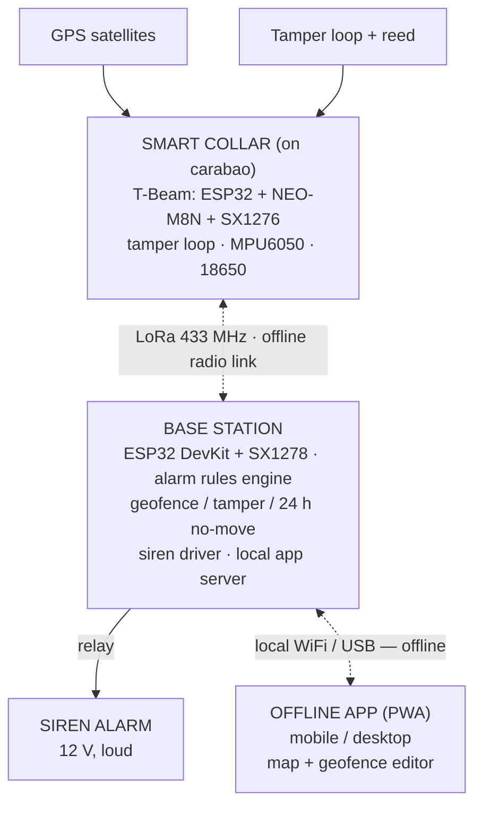

# SmartCollar

**Offline GPS and LoRa-Based Smart Collar System for Carabao Location Monitoring and Tamper Detection**

A carabao wears a sealed, adjustable smart collar that acquires its GPS position and streams it over a LoRa radio link to a farm base station — **no internet, no cellular signal, no subscriptions**. The base station checks every position against a geofence, watches for collar tampering and 24-hour immobility, and sounds a siren alarm on any abnormal condition. Farmers monitor locations and configure geofences from an **offline mobile/desktop app** that talks directly to the base station.

> Offline-first by design: the farm has no internet connection, so GPS (positioning) + LoRa (communication) are the only technologies used in the field.

---

## Table of Contents

- [About](#about)
- [Main System](#main-system)
- [How It Works](#how-it-works)
- [Features & Alarm Conditions](#features--alarm-conditions)
- [System Architecture](#system-architecture)
- [Hardware](#hardware)
- [Design Priorities](#design-priorities)
- [Repository Structure](#repository-structure)
- [Build Guide](#build-guide)
- [Documentation Index](#documentation-index)
- [Power Strategy](#power-strategy)
- [Roadmap](#roadmap)
- [Team](#team)
- [Acknowledgment](#acknowledgment)

## About

Carabao theft, straying, and unmonitored sickness are real losses for smallholder farms — and rural grazing land usually has **no internet or cellular coverage**, which rules out commercial GSM/GPS trackers. SmartCollar is built for that reality: positioning comes from GPS satellites, communication travels over LoRa radio (kilometer-scale range, very low power), and all alarm logic runs locally at the base station. The whole system works even when the farm is completely offline.

The collar is worn by the animal full-time, so the **mechanical design is as critical as the electronics**: the collar is exposed to water (carabaos wallow and swim), mud, impact, pulling, and constant movement. Every design decision in this repo reflects that.

## Main System

| Component | Location | Role |
|---|---|---|
| **Smart Collar** | Worn by the carabao | GPS positioning, LoRa uplink, tamper detection, battery telemetry |
| **Base Station** | Fixed, powered point at the farm | Receives LoRa data, evaluates alarm rules, drives the siren, serves the app |
| **Offline Mobile/Desktop App** | Farmer's device | Location & status dashboard, geofence configuration |
| **Siren Alarm** | At the base station | Loud audible alert on any detected abnormal condition |

## How It Works

```
Carabao → Smart Collar → GPS + LoRa → Base Station → Siren + Offline App
```

1. The collar wakes on a duty cycle, gets a GPS fix, checks its tamper loop, and sends one compact LoRa packet (position, battery, tamper state, movement activity).
2. The base station receives the packet and evaluates three alarm rules:
   - **Geofence** — is the position inside the allowed polygon?
   - **Tamper** — strap cut, buckle opened, or loop bypassed?
   - **No movement for 24 hours** — possible downed or sick animal.
3. On any abnormal condition, the base station **fires the siren** and pushes an alert to the app.
4. The farmer opens the offline app (connected directly to the base station over local WiFi/USB) to see live locations, history, status, and to **draw or edit the geofence**, which is pushed down to the collars.

## Features & Alarm Conditions

The system raises an alarm when:

| # | Condition | What it means |
|---|---|---|
| 1 | **Geofence breach** | The carabao left the allowed grazing area |
| 2 | **Collar tamper** | Strap cut, buckle opened/removed, or tamper circuit bypass attempt |
| 3 | **No movement for 24 hours** | Abnormal condition — animal may be downed, trapped, or sick; needs physical checking |

Additional capabilities:

- 100% offline operation — GPS + LoRa only, no internet connection needed at the farm
- Live location and history trail per collar, on an offline map in the app
- Geofence drawing/editing from the app, pushed to collars via the base station
- Battery level telemetry with low-battery warning
- Adjustable collar (fits different animals) **without** sacrificing tamper detection

## System Architecture



Details: [docs/BLOCK-DIAGRAM.md](docs/BLOCK-DIAGRAM.md) · [docs/SYSTEM-ARCHITECTURE.md](docs/SYSTEM-ARCHITECTURE.md) · [docs/FLOWCHART.md](docs/FLOWCHART.md) · [docs/STACK.md](docs/STACK.md)

## Hardware

Core components (full list with indicative prices: **[docs/BOM.md](docs/BOM.md)**):

| Component | Role |
|---|---|
| LilyGO T-Beam v2.x | Collar core — ESP32 + GPS (NEO-M8N) + LoRa (SX1276) + 18650 battery interface in one board |
| 18650 Li-ion cell + holder | Collar power (Phase 1) |
| Conductive tamper loop (stainless wire rope / conductive thread) + reed switch | Tamper detection on the adjustable strap |
| IP67 enclosure + PG7 glands + Suxun T7000 silicone sealant | Waterproof housing (carabaos wallow in water/mud) |
| Flexible whip antenna (433/915 MHz) | LoRa uplink, bulkhead-mounted, strain-relieved |
| MPU6050 accelerometer (GY-521) | Movement activity for the 24-hour no-movement rule |
| ESP32 DevKit + SX1278 LoRa module | Base station receiver |
| 12V waterproof siren + relay/MOSFET | Audible alarm at the base station |
| 5V solar panel + Li charge module (future) | Phase 2 solar upgrade — farm-recommended |

## Design Priorities

The current design focus, in order of difficulty — each has a dedicated document:

| Priority | Document | Summary |
|---|---|---|
| Adjustable collar + reliable tamper circuit | [TAMPER.md](docs/TAMPER.md) | A continuous conductive loop across the **adjustable** portion — detects cut, buckle open, and bypass |
| Waterproof enclosure | [ENCLOSURE.md](docs/ENCLOSURE.md) | Sealed against wallowing/submersion, impact-resistant, protects electronics |
| Antenna strategy | [ENCLOSURE.md](docs/ENCLOSURE.md) | External antenna vs. sealed performance — must not degrade LoRa/GPS |
| Battery management | [POWER.md](docs/POWER.md) | Duty-cycled operation for weeks per charge |
| Solar-ready mechanical design | [ENCLOSURE.md](docs/ENCLOSURE.md) + [POWER.md](docs/POWER.md) | Farm recommends solar collars (video in `references/`); enclosure is solar-ready from day one |
| Physical form factor | [ENCLOSURE.md](docs/ENCLOSURE.md) | Based on the farm's recommendation and sample collar |

> **Key point:** this is not just a software/electronics project. The **mechanical design of the collar itself is critical** — it is exposed to water, mud, impact, pulling, and constant movement for its entire service life.

## Repository Structure

```
smartcollar/
├── README.md               ← you are here
├── docs/
│   ├── BOM.md              ← parts list with indicative prices
│   ├── HARDWARE.md         ← collar electronics, wiring, assembly
│   ├── TAMPER.md           ← tamper loop design on the adjustable collar
│   ├── ENCLOSURE.md        ← waterproofing, mechanical, antenna, solar-ready design
│   ├── POWER.md            ← battery management + solar roadmap
│   ├── FIRMWARE.md         ← collar & base station firmware, LoRa protocol
│   ├── BASE-STATION.md     ← receiver, siren, coverage planning
│   ├── APP.md              ← offline dashboard, geofence editor
│   ├── TESTING.md          ← test & evaluation protocol
│   ├── STACK.md            ← full technology stack reference
│   ├── BLOCK-DIAGRAM.md    ← hardware blocks & signal chains
│   ├── FLOWCHART.md        ← runtime decision logic
│   └── SYSTEM-ARCHITECTURE.md ← layers, interfaces, failure modes
└── references/             ← datasheets, farm video, related material
```

## Build Guide

The build is organized into stages. Follow in order:

| Step | Guide | What you'll do |
|---:|---|---|
| 1 | [docs/BOM.md](docs/BOM.md) | Order all parts |
| 2 | [docs/HARDWARE.md](docs/HARDWARE.md) | Assemble collar electronics, verify T-Beam GPS + LoRa |
| 3 | [docs/TAMPER.md](docs/TAMPER.md) | Build and validate the adjustable tamper loop |
| 4 | [docs/ENCLOSURE.md](docs/ENCLOSURE.md) | Seal the enclosure, mount antenna, solar-ready lid |
| 5 | [docs/POWER.md](docs/POWER.md) | Configure duty cycling, measure battery endurance |
| 6 | [docs/FIRMWARE.md](docs/FIRMWARE.md) | Flash collar + base station, tune the LoRa protocol |
| 7 | [docs/BASE-STATION.md](docs/BASE-STATION.md) | Install receiver, siren, coverage survey |
| 8 | [docs/APP.md](docs/APP.md) | Set up the offline dashboard + geofence editor |
| 9 | [docs/TESTING.md](docs/TESTING.md) | Run the full verification protocol |

## Documentation Index

| Document | Contents |
|---|---|
| [BOM.md](docs/BOM.md) | Collar + base station parts, specs, indicative PH prices |
| [HARDWARE.md](docs/HARDWARE.md) | T-Beam pin map, wiring tables, accelerometer, assembly |
| [TAMPER.md](docs/TAMPER.md) | Tamper loop options, supervised-loop circuit, bypass resistance, alarm codes |
| [ENCLOSURE.md](docs/ENCLOSURE.md) | IP-rating targets, sealing strategy, antenna mounting, solar-ready design, mechanical tests |
| [POWER.md](docs/POWER.md) | Power budget, duty cycle, charging rotation, solar sizing |
| [FIRMWARE.md](docs/FIRMWARE.md) | State machines, LoRa packet format, geofence & alarm logic |
| [BASE-STATION.md](docs/BASE-STATION.md) | Hardware, antenna placement, siren wiring, range planning |
| [APP.md](docs/APP.md) | Offline maps, dashboard, geofence editor, tech options |
| [TESTING.md](docs/TESTING.md) | Range, GPS, tamper, immersion, endurance, mechanical tests |
| [STACK.md](docs/STACK.md) | Full technology stack — collar, base station, app, radio link |
| [BLOCK-DIAGRAM.md](docs/BLOCK-DIAGRAM.md) | Hardware blocks, tamper sense circuit, signal chains |
| [FLOWCHART.md](docs/FLOWCHART.md) | Runtime logic — collar duty cycle, base alarm pipeline, app session |
| [SYSTEM-ARCHITECTURE.md](docs/SYSTEM-ARCHITECTURE.md) | Layers, component responsibilities, interfaces, failure modes |

## Power Strategy

- **Phase 1 (prototype):** battery-powered collars — 18650 Li-ion with aggressive duty cycling (GPS fix + LoRa packet every few minutes, deep sleep between), targeting weeks of runtime per charge with a swap-and-charge rotation.
- **Phase 2 (recommended by the farm):** solar-powered collars. The farm sent a video showing a sample collar with a solar panel, so the **enclosure is designed solar-ready from day one** — the upgrade should be a lid swap, not a redesign. See [POWER.md](docs/POWER.md).

## Roadmap

- [ ] Parts ordered & verified (BOM)
- [ ] T-Beam bench test: GPS fix + LoRa link
- [ ] Tamper loop working on an adjustable strap
- [ ] Enclosure passes immersion test
- [ ] Full collar worn-test on animal (comfort, anti-rotation, wallow test)
- [ ] Base station + siren installed at farm
- [ ] Offline app with geofence editor
- [ ] Field trial: multi-day herd monitoring
- [ ] Solar lid prototype (Phase 2)

## Team

`[Course / Program]` · `[University]`

- `[Student Name]`
- `[Student Name]`
- `[Student Name]`

Adviser: `[Adviser Name]`

## Acknowledgment

Pilot client: **[Farm name]** — who recommended the solar collar direction and provided a sample collar video (kept in `references/`).

*This project is an academic prototype. The full manuscript is available from the team on request.*
