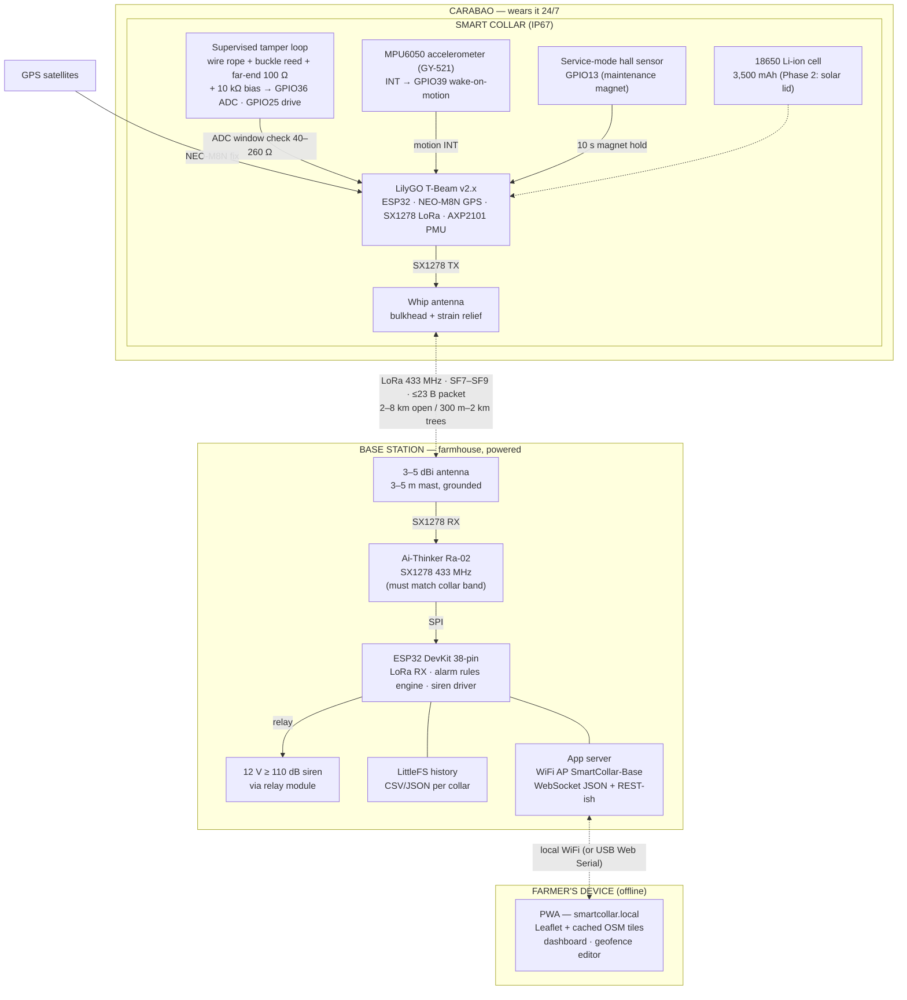
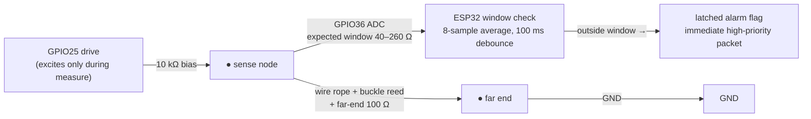

# Block Diagram

Hardware blocks and the signals that connect them — the physical view of SmartCollar. Diagrams are **Mermaid** and render natively on GitHub.

---

## 1. Overall System Block Diagram

**Flows:** collar→base is LoRa uplink (offline radio) · base→collar is downlink (geofence push, interval change, ACKs, clear-tamper-latch) · base→farmer is local WiFi AP / USB — **nothing touches the internet**.

---

## 2. Tamper Loop Sense Circuit

| Attack | ADC sees | Result |
|---|---|---|
| Intact collar | designed resistance (~40–260 Ω window) | normal |
| **Cut** anywhere (incl. adjustment tail) | full pull-up | alarm |
| **Bypass** (jumper near body) | skips far-end resistor → too low | alarm |
| Splice-in wire to fake resistance | momentary open during splice | latched alarm |

---

## 3. Signal Chain Summary

| Signal | Source → Destination | Conditioning | Meaning |
|---|---|---|---|
| GPS fix | NEO-M8N → ESP32 UART (TinyGPSPlus) | warm-start ephemeris in RTC RAM | position; no fix → last fix flagged STALE |
| Tamper ADC | loop → GPIO36 via 10 kΩ bias | 8-sample avg, 100 ms debounce, window 40–260 Ω | resistance signature vs. cut/bypass |
| Loop drive | GPIO25 → loop | excited only during measurement | power save + defeats corrosion-offset attacks |
| Motion INT | MPU6050 INT → GPIO39 | motion-detect interrupt (accel-only cycle mode) | activity counter for 24 h rule + wake |
| Service mode | hall sensor → GPIO13 | magnet held 10 s | maintenance window (no alarms) |
| Battery telemetry | AXP2101 → ESP32 | BAT_PERCENT in packet | low-battery app alert (< 20%) |
| LoRa uplink | collar SX1278 → base Ra-02 (SX1278) | SF7–SF9, sync 0x2B, ≤23 B, ±5% jitter | position + flags + battery + activity |
| LoRa downlink | base → collar | at wake windows / daily sync | geofence polygon, interval, ACK, latch clear |
| Siren drive | GPIO → relay → 12 V siren | patterned per alarm type | geofence 3-short/2-min · tamper continuous · no-move 10 s/5 min |

---

Electrical details: [HARDWARE.md](HARDWARE.md) · loop design: [TAMPER.md](TAMPER.md) · Logic: [FLOWCHART.md](FLOWCHART.md) · Layers: [SYSTEM-ARCHITECTURE.md](SYSTEM-ARCHITECTURE.md)
