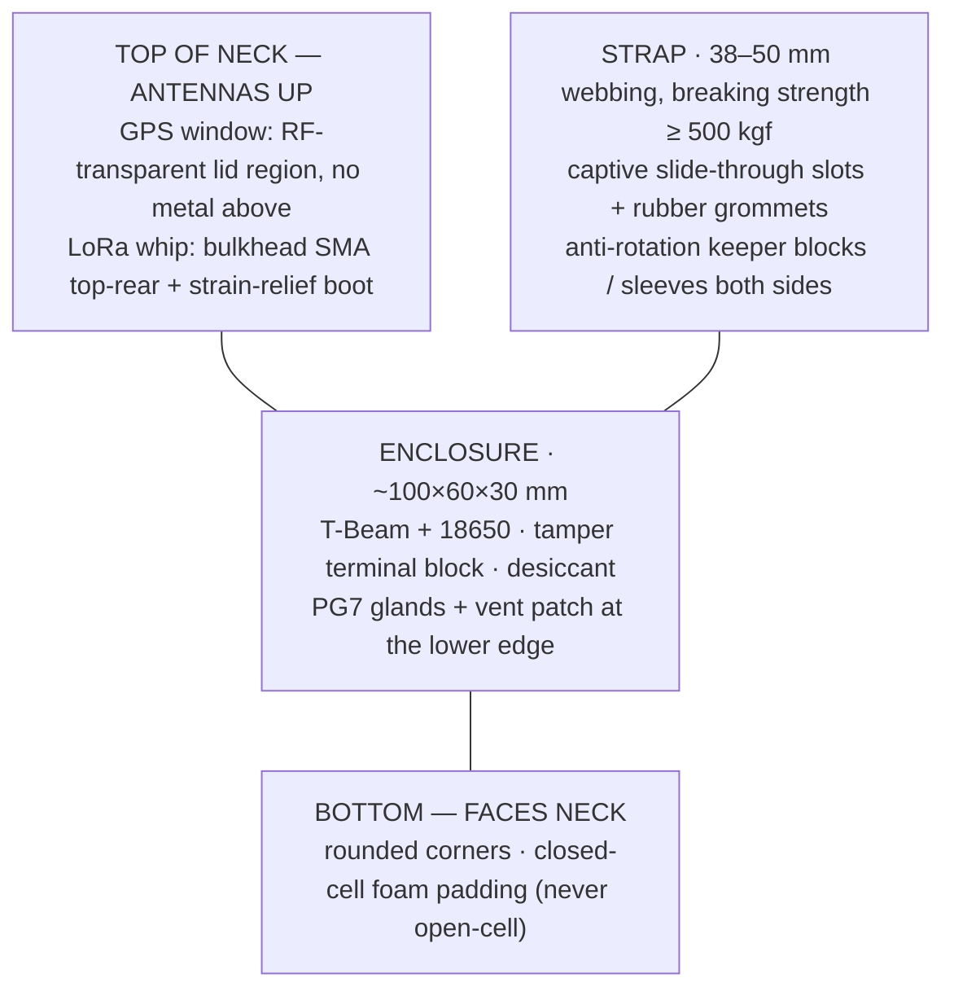

# Enclosure, Waterproofing & Mechanical Design

The collar lives in one of the harshest consumer-IoT environments possible: **water (carabaos wallow and swim), mud, impact from rubbing/horns/trees, pulling forces of a 400–900 kg animal, and constant flexing for months.** The electronics are only as good as the package around them.

---

## Requirements

| Requirement | Target |
|---|---|
| Water/dust ingress | **IP67** minimum (1 m submersion, 30 min — wallow depth is realistic) |
| Impact | Survives being slammed against trees/ground; UV-stable for outdoor life |
| Pull force | Strap rated ≥ 500 kgf; enclosure mounting must not be the weak point |
| Operating temp | 0–50 °C (incl. direct sun on a black enclosure — prefer light colors) |
| Antennas | LoRa + GPS must work through/around the housing without significant loss |
| Serviceability | Battery swap without destroying the seal (glue-once = dead collar later) |
| Solar-ready | Lid can accept a small panel later **without redesign** |
| Animal comfort | No sharp edges, anti-rotation on the strap, balanced weight |

## Enclosure Options

| Option | Waterproofing | Antenna | Cost | Verdict |
|---|---|---|---|---|
| Off-the-shelf IP67 junction box + PG7 glands | Excellent | Needs glands for external antennas | Low | **Baseline choice** — fast, reliable, ugly but proven |
| 3D-printed ASA/PC + silicone gasket + bolted lid | Good (IP65–67 achievable with care) | Glands or embedded antenna window | Medium | Good for custom form factor; print in **ASA** (UV + heat), never PLA |
| Potting the whole T-Beam in epoxy | Excellent | Antennas must be fully external | Low | Phase-2 consideration; makes repair impossible |

**Chosen approach: IP67 box + glands for Phase 1**, custom 3D-printed ASA housing on the solar-ready roadmap.

## Sealing Strategy

1. **Lid seal:** replace the stock foam gasket with **silicone cord or die-cut silicone gasket** seated on a thin bead of **Suxun T7000**, torque screws evenly in cross pattern; add stainless screws (galvanic corrosion with aluminum heatsinks otherwise). The T7000 seals the joint — the screws and gasket compression still do the structural work.
2. **Cable pass-throughs:** everything exits via **PG7 glands with O-rings**, with a drip loop below the gland so water tracks away from the seal; run a **T7000 bead on gland threads and locknuts** at final assembly. Antenna connectors (SMA bulkhead) double as sealed pass-throughs.
3. **Conformal coat the PCB** (acrylic conformal coating at minimum) so even interior condensation doesn't kill the board — temperature swings cause breathing/condensation even in a "sealed" box.
4. **Desiccant sachet** inside (silica gel, replaced at every battery service) absorbs residual moisture.
5. **Pressure equalization:** a small **Gore-style vent patch (IP-rated breathable membrane)** on the lid stops the vacuum/breathing cycle that pulls water past seals over time.
6. **Serviceability:** battery is reached by opening the lid — replace gasket on re-close; log every opening in the app maintenance record.
7. **Cure time:** Suxun T7000 needs **24–48 h to fully cure** before immersion testing — schedule waterproof tests at least two days after assembly.

## Antenna Strategy (the T-Beam problem)

The LilyGO T-Beam's stock antennas stick out on SMA connectors — exposed metal whips that will snap or leak at the collar's gasket line. Options:

| Approach | LoRa link budget | GPS | Mechanical risk | Verdict |
|---|---|---|---|---|
| Stock SMA whips through glands | Best | Good (patch) | Whips break on impact; two more holes in the seal | Reject |
| **Flexible whip LoRa antenna inside a sealed tube/bulkhead SMA** | Good | n/a | Low — flexes on impact | **Chosen (LoRa)** |
| u.FL → external antenna on a **bulkhead SMA on top of the enclosure**, flexible whip above | Good | n/a | Low | **Chosen (LoRa), final layout** |
| GPS ceramic patch inside under the lid (RF-transparent top window) | n/a | Acceptable (~2–4 dB loss) | None | **Chosen (GPS)** |

Design rules:

- **Metal lids kill antennas.** Use a plastic (or 3D-printed) top window region for the GPS patch — the enclosure top above the GPS antenna must be non-metallic and RF-clean (no metal screws directly above).
- LoRa antenna exits **top-rear of the enclosure, bulkhead-mounted, with a flexible whip** — a rigid whip WILL be broken by the animal within days. Add a small rubber strain-relief boot.
- Antenna must sit **above the waterline of typical wallowing** if possible: enclosure rides on the **top/side of the neck**, antennas pointing up.
- The antenna ground plane: a small ground plane improves LoRa range; a piece of copper foil on the lid interior behind the whip, if it doesn't conflict with GPS.

## Collar Form Factor & Mechanical Layout

- **Strap:** 38–50 mm **nylon/polyester webbing** (same material as tie-out/tow straps), breaking strength ≥ 500 kgf. Wide strap = pressure spread = no neck sores.
- **Attachment:** enclosure **captively slid onto the strap** through molded/printed slots with rubber grommet isolators (anti-vibration + anti-slide) — the enclosure must not spin around the neck or slide to the throat.
- **Anti-rotation:** two rubber "keeper" blocks on the strap either side of the box keep it riding on the top of the neck.
- **Padding:** closed-cell foam on the underside for comfort; open-cell foam would soak water — avoid.
- **Edges:** everything chamfered/rounded; no zip-tie heads against skin.
- **Weight target:** entire collar < 600 g (comfort + avoids behavior change).
- **Torque/pull test:** hang 100 kg from assembled collar for 10 min — no deformation, no seal breach, loop resistance unchanged.

## Solar-Ready Design (Phase 2 prep)

The farm recommends solar collars (sample video in `references/`). Phase 1 must not paint us into a corner:

1. **Lid is a separate, swappable part** — Phase-2 lid has a cutout + gasket channel for a **5V 0.5–1 W PET laminate panel** bonded with **Suxun T7000** (electronics-safe, non-corrosive cure — never use acidic-cure RTV near the board).
2. **Wiring pre-provisioned:** a 2-pin sealed connector (JST with silicone gasket) from the lid area to the charge module is already routed/terminated in Phase 1, capped with a dummy plug.
3. **Volume reserved** in the enclosure layout for a CN3065 solar charge module (~15×15 mm) — no relocation later.
4. Panel faces up on the **top of the neck** — where the antennas are — so panel must sit **between** antennas (GPS window forward, solar panel rear) or on the enclosure's flat top with antennas at the rear edge. Panel shading by the animal's head is a real loss factor; accept partial shading and oversize the panel modestly (MPPT not needed at 0.5 W).
5. See [POWER.md](POWER.md) for the electrical side.

## Environmental Test Checklist

- [ ] **Immersion:** 1 m depth, 30 min (IP67) — no ingress; repeat after 10 lid cycles
- [ ] **Wallow simulation:** 24 h in mud + water slurry, pressure-washed, then full function test
- [ ] **Thermal:** enclosure interior < 60 °C under direct noon sun with battery inside (Li-ion must stay < 45 °C — light-colored enclosure if this fails)
- [ ] **Impact:** drop 2 kg mass onto enclosure from 1 m; strap whacked against post 50×
- [ ] **Pull:** 100 kg static load 10 min on assembled collar
- [ ] **Flex:** 10k bend cycles at the gland/antenna boots — no conductor fatigue
- [ ] **UV:** outdoor 2-week exposure — no gasket hardening (check datasheet ratings)
- [ ] **Animal trial:** worn 72 h by actual carabao — no sores, no rotation, antennas intact, seal intact
