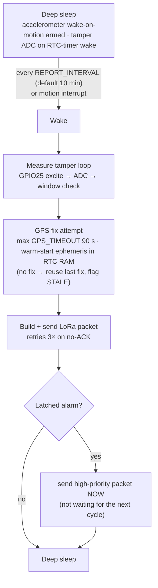
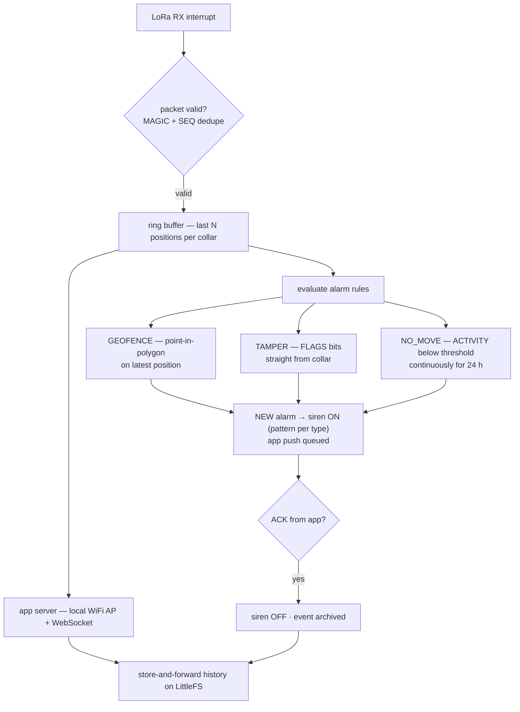

# Firmware — Collar & Base Station

Arduino-IDE C++ (Arduino-ESP32 core) for both collar and base station. One repo, two sketches:

```
firmware/
├── collar/        ← LilyGO T-Beam v2.x
└── basestation/   ← ESP32 DevKit + Ra-02 (SX1278)
```

---

## Collar Firmware

### Main state machine



Key configuration (stored in NVS, editable over-the-air from app via base station):

| Param | Default | Meaning |
|---|---|---|
| `REPORT_INTERVAL` | 10 min | Position packet period |
| `GPS_TIMEOUT` | 90 s | Max fix wait per cycle |
| `GEOFENCE` | from app | Polygon (max 16 vertices) evaluated on-collar for early warning |
| `NO_MOVE_HOURS` | 24 h | Immobility rule window |
| `COLLAR_ID` | per unit | Stable short ID used in packets |

### Power-critical implementation notes

1. **Deep sleep current is the project's #1 silent killer.** A naive T-Beam deep sleep drains in days. In `esp_sleep` setup, disable: LoRa (SX1278 sleep opmode), GPS power rail (AXP2101 GPS rail off), and unused AXP rails. Measure with a µA meter — target < 2 mA whole-system sleep, ideally < 500 µA. See [POWER.md](POWER.md).
2. **Motion-gated GPS:** if the accelerometer activity counter hasn't moved since the last fix, skip GPS — resend last position with `moved=false`. Saves up to 80% of energy.
3. **Tamper excitation only during measurement** (GPIO25 drive) — no constant current through the loop (also prevents electrolytic corrosion of the rope).
4. **Ephemeris warm start:** with RTC RAM retained across deep sleep, warm fixes take 5–15 s instead of 30–60 s — the single biggest energy lever after duty cycling.
5. **Latched alarms:** a *confirmed* tamper event (`LOOP_OPEN` / `LOOP_BUCKLE` / `LOOP_SHORT` — steady out-of-window reading, debounced) latches a flag; the next wake sends the alarm immediately, then keeps sending at 1-min intervals until ACKed by base. (Keep-alive: a collar under attack must not go quiet.) A *brief* out-of-window glitch that re-closes within the debounce window latches `LOOP_SUSPECT` instead — a telemetry warning, never a siren trigger (strap-flex false-alarm guard; see [TAMPER.md](TAMPER.md)).

### Libraries

| Library | Use |
|---|---|
| `RadioLib` | SX127x LoRa — `SX1278` class for the 433 MHz variant (better power control than LoRa.h) |
| `TinyGPSPlus` | NEO-M8N NMEA parsing |
| `Adafruit_MPU6050` | Accelerometer + motion-detect interrupt (wake-on-motion via registers: MOT_THR / MOT_DUR, accel-only cycle mode) |
| `AXP2101` (LilyGO / x-lqi) | PMU rail management on T-Beam v2.x |
| `ArduinoJson` | Packet serialization + app/base config messages |

## LoRa Radio Settings

| Parameter | Value |
|---|---|
| Frequency | 433 MHz (or 915 — **must match base station**; PH allocations: prefer 433 MHz ISM band for this use) |
| Spreading factor | SF7–SF9 (SF7 fast/short range; SF9 for far paddocks — configurable per site) |
| Bandwidth | 125 kHz |
| Coding rate | 4/5 |
| Sync word | private 0x2B (not LoRaWAN — raw point-to-multipoint) |
| Preamble | 8 |

> Raw LoRa, not LoRaWAN: no gateway/network-server infrastructure exists offline, and we control both ends. Simple ACK/retry protocol below.

## Packet Format (binary, 23 bytes max body)

```
Byte  Field        Meaning
0     MAGIC        0x5C
1     COLLAR_ID    uint8 (stable per collar)
2     FLAGS        bit0 GEOFENCE_OUT (on-collar pre-check)
                    bit1 TAMPER (latched)
                    bit2 TAMPER_BUCKLE (buckle-open subtype)
                    bit3 TAMPER_SHORT (bypass subtype)
                    bit4 NO_MOVE_24H
                    bit5 LOW_BATT
                    bit6 STALE_FIX (reused position)
                    bit7 EMERGENCY (send now, ACK required)
3     BAT_PERCENT  uint8 (0–100)
4-7   LAT          int32  (1e-6 deg, signed)
8-11  LON          int32  (1e-6 deg)
12    ACTIVITY     uint8 (0–255, rolling motion score)
13    LOOP_R       uint8 (tamper loop resistance / 8, 0–2040 Ω)
14    SEQ          uint8 (packet sequence, wrap)
```

Fixed fields total **15 bytes** — the ≤ 23-byte body budget reserves headroom for future telemetry (e.g., collar temperature). `LOOP_SUSPECT` warnings surface via the `LOOP_R` reading (no dedicated flag bit).

Base → collar downlink (sent when base has app data to push): geofence update (polygon), interval change, ACK for emergency packets, clear-tamper-latch (service mode).

### Simple MAC

- One base station is the sink; collars transmit on their interval with **randomized ±5% jitter** to avoid collisions (battery-drain-herd-sync is a classic failure).
- Emergency packets retry up to 3× at 30 s spacing until base ACKs.
- Base sends a broadcast timeslot sync once daily; collars align wake windows for geofence push-down.

## Base Station Firmware



- **Siren:** relay-driven 12 V siren; distinct patterns: geofence = 3 short/2 min pause repeat; tamper = continuous; no-movement = long 10 s every 5 min. Auto re-arm.
- **History:** LittleFS CSV/JSON per collar (position, flags, loop R, batt) — months of data at 10-min intervals is small (~100 KB/collar/month).
- **Watchdog:** ESP32 task watchdog on both LoRa RX and app server loops; base station is unattended hardware, it must self-heal.

## Flashing & Config

1. Arduino IDE → board "ESP32 Dev Module" (T-Beam), 921600 upload; USB-C on v2.x powers and flashes directly.
2. First boot creates NVS config with defaults; set `COLLAR_ID` via serial CLI (`id 7`) or app.
3. Serial console at 115200 — keep it attached for the first week of field testing (log everything).
4. OTA over the app link is a stretch goal — bench flash until it's proven in the field.

## Bench Acceptance (pre-deploy gate)

- [ ] 48 h continuous run, zero missed expected packets at 10 m range
- [ ] Deep-sleep current within budget (see [POWER.md](POWER.md))
- [ ] All three alarm types produce correct siren patterns on the base
- [ ] Geofence push-down reaches collar within 24 h window
- [ ] SEQ dedupe works (inject replayed packets — no duplicate alarms)
