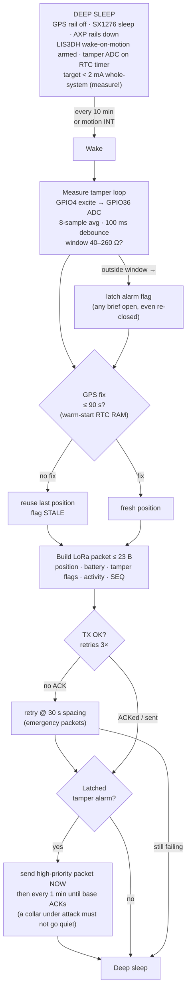
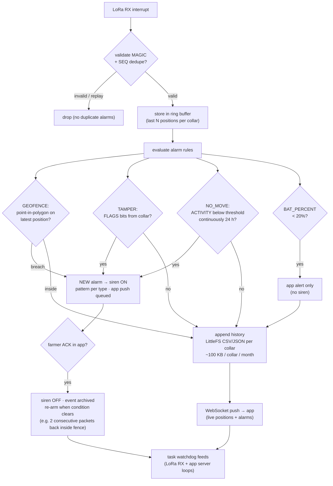
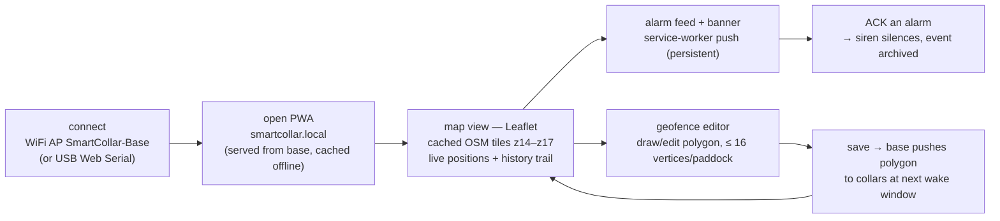
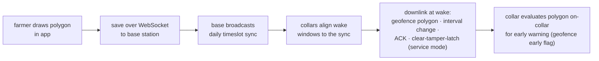

# Flowchart

Runtime behavior, decision by decision — the logic view of SmartCollar, matching the actual firmware state machines in FIRMWARE.md. Diagrams are **Mermaid** and render natively on GitHub.

---

## 1. Collar Main State Machine

One duty cycle, every `REPORT_INTERVAL` (default 10 min) or motion interrupt:

## 2. Base Station Alarm Pipeline

Every received packet walks the rules engine:

**Siren patterns:** geofence = 3 short / 2-min pause repeat · tamper = continuous · no-movement = 10 s every 5 min. Auto re-arm.

## 3. App Session (farmer)

## 4. Geofence Push-Down Path

---

State machine source: [FIRMWARE.md](FIRMWARE.md) · alarm rules & hysteresis: [BASE-STATION.md](BASE-STATION.md) · Blocks & signals: [BLOCK-DIAGRAM.md](BLOCK-DIAGRAM.md) · Layers: [SYSTEM-ARCHITECTURE.md](SYSTEM-ARCHITECTURE.md)
