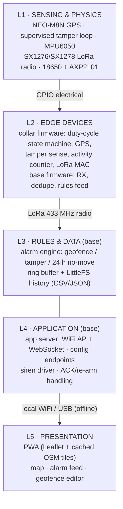
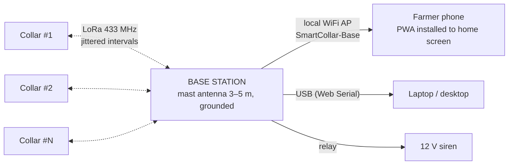
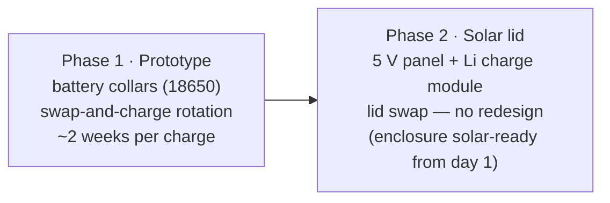

# System Architecture

Layers, boundaries, and interfaces — how SmartCollar is organized as a system, from strap to siren. Diagrams are **Mermaid** and render natively on GitHub.

---

## 1. Layered View

**Key boundary decisions:**

- **Collar senses, base decides.** The collar's job is a compact, honest packet: position, battery, tamper flags, activity. All alarm logic — geofence, tamper verdict, 24-hour immobility — runs at the base, where power and compute are unlimited. Collars stay dumb, cheap, and low-power.
- **Raw LoRa, not LoRaWAN.** There is no offline gateway/network-server infrastructure, and we control both ends. A simple ACK/retry MAC with jittered intervals replaces it entirely.
- **The base *is* the internet.** Tile cache, app, config, history, alarms — all served from one ESP32 over local WiFi or USB. The farmer's phone never needs a network beyond the farm.
- **Collar evaluation is early-warning only.** The collar can hold the geofence polygon and flag "outside" on-carpet, but the base's point-in-polygon verdict is authoritative.

## 2. Component Responsibilities

| Component | Owns | Never does |
|---|---|---|
| NEO-M8N GPS | position fixes (warm-start ephemeris in RTC RAM) | alarm decisions |
| Supervised tamper loop | resistance signature of the intact collar (40–260 Ω window) | power switching |
| MPU6050 | motion activity + motion-detect interrupt | position (GPS's job) |
| Collar ESP32 | duty cycle, tamper ADC, packet build/TX, latch handling | point-in-polygon verdicts (early flag only) |
| Base ESP32 | RX/dedupe, alarm rules, siren patterns, app server, history | GPS fixes |
| LittleFS history | durable per-collar log (position, flags, loop R, batt) | alarm logic |
| Siren | audible alert, patterned per alarm type | logic |
| PWA | map, alarm feed, ACK, geofence drawing | rule evaluation (base's job) |

## 3. Interfaces (the contract set)

| # | Interface | Protocol | Contract |
|---|---|---|---|
| I1 | GPS → collar UART | NMEA (TinyGPSPlus) | fix within 90 s or STALE reuse |
| I2 | Tamper loop → GPIO36 | analog ADC via 10 kΩ bias, GPIO25 excite | window 40–260 Ω; outside = latched alarm |
| I3 | MPU6050 INT → GPIO39 | digital interrupt | wake-on-motion (accel-only cycle mode) + activity counting |
| I4 | Hall sensor → GPIO13 | digital, 10 s magnet hold (RTC pin, wake-capable) | service/maintenance window |
| I5 | Collar → base SX1276→SX1278 | raw LoRa 433 MHz, SF7–SF9, sync 0x2B, ≤23 B binary | position, battery, tamper flags, activity, SEQ |
| I6 | Base → collar downlink | LoRa at wake windows / daily sync | geofence polygon, interval change, ACK, clear-tamper-latch |
| I7 | Base → browser | local WiFi AP + WebSocket JSON | live positions, alarms, config push |
| I8 | Base ↔ USB device | Web Serial (Chrome) | most-reliable zero-WiFi channel |
| I9 | Base → siren | GPIO → relay → 12 V | patterned drive per alarm type |

## 4. Network Topology

- **One star topology:** all collars → one base; nothing meshed, nothing routed. A dead collar can't take others down.
- **Frequency plan:** 433 MHz ISM preferred in PH; collar and base bands **must match**.
- **Range reality:** 2–8 km open/rolling terrain, 300 m–2 km dense trees (SF7–SF9 choice per site) — the site survey decides placement, not hope.
- **No SIM, no router, no cloud:** the only external dependency is GPS satellites.

## 5. Failure Modes & Degradation

| Failure | Immediate effect | System behavior |
|---|---|---|
| GPS no-fix (canopy, rain) | position STALE | reuse last fix, flag it; alarm rules keep running on stale data |
| LoRa packet lost | missed position | SEQ dedupe on RX; emergency packets retry 3× @ 30 s; buffer at next wake |
| Collar battery low | shorter radio life | BAT_PERCENT telemetry → app alert < 20%; swap-and-charge rotation |
| Base brownout | rules pause | UPS/power-bank on 5 V rail; history in LittleFS survives; watchdog self-heals |
| Lightning storm | antenna risk | disconnect procedure; collars buffer-and-retry — an offline hour is fine |
| Tamper false positives (corrosion) | spurious alarms | 8-sample ADC averaging, window margins, debounce; service magnet = maintenance window |
| Farmer misses alarm | siren keeps sounding | re-arm logic: ACK silences siren but event persists until condition clears (e.g., 2 packets back inside fence) |
| App phone offline | no dashboard | cached PWA opens offline; history catches up over WebSocket on reconnect |

**Design principle:** every abnormal condition is *latched* — a transient (brief loop open, one lost packet) can never silently clear itself without the base seeing it.

## 6. Deployment Topology (prototype → production path)

The architecture doesn't change between phases — only the collar's power source (and the enclosure lid). Base, radio, rules, and app are identical.

---

Interfaces in detail: [FIRMWARE.md](FIRMWARE.md) §packet format · Alarm rules: [BASE-STATION.md](BASE-STATION.md) · Signals: [BLOCK-DIAGRAM.md](BLOCK-DIAGRAM.md) · Logic: [FLOWCHART.md](FLOWCHART.md)
