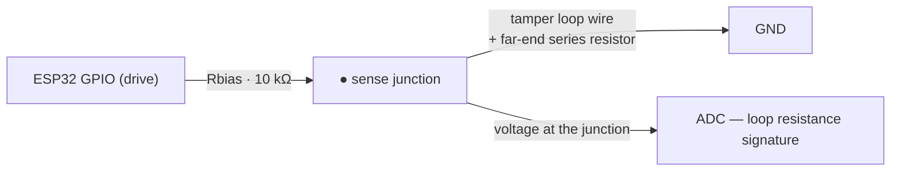

# Tamper Detection on an Adjustable Collar

The collar must be **adjustable** (fits different animals / neck growth) yet must still reliably detect:

1. **Cutting** the strap
2. **Opening/removing** the buckle
3. **Bypassing** the tamper circuit (e.g., jumpering the loop before cutting)

The core challenge: run a **continuous, supervised electrical loop through the adjustable portion** of the collar without interfering with the adjustment mechanism.

---

## Design Principle: Supervised Loop (Normally-Closed + End-of-Line)

A simple "wire broken = alarm" loop is easy to bypass (short the two ends, then cut freely). Instead we use a **supervised loop** — the collar firmware continuously measures loop **resistance**, not just continuity:



- The tamper loop itself has a **known, designed resistance** (e.g., ~50–200 Ω from the wire rope + a small series resistor at the far end).
- The ADC reading gives a unique "signature" for the intact collar.
- **Cut** → loop opens → ADC reads full pull-up → alarm.
- **Bypass (jumper across the strap)** → resistance drops (jumper has ~0 Ω, skipping the series resistor) → alarm.
- **Any tampering with the measuring node** → reading moves out of the expected window → alarm.

Firmware keeps a valid window (e.g., 40–260 Ω); anything outside it — including *too low* — is a tamper alarm. This defeats the classic "short it first, then cut" bypass.

### Why a series resistor at the far end?

The far end of the loop carries a resistor that the attacker cannot skip without cutting the loop. If they jumper near the collar body, they bypass the far-end resistor → reading too low → alarm. If they splice wire in to keep resistance, they must still cut somewhere → momentary open → alarm (firmware latches any brief open event).

---

## Loop Routing on the Adjustable Strap


Requirements:

- The conductive path runs the **entire working length** of the strap — the adjustable tail included — so cutting *anywhere* (including excess tail) breaks the loop.
- The path must **survive repeated adjustment** (sliding through the buckle) without fraying or breaking.

### Recommended loop material

| Material | Pros | Cons |
|---|---|---|
| **Stainless steel wire rope, ~1 mm 7×7** (chosen) | Extremely cut-resistant, survives mud/water, cheap, works with crimp terminals | Stiffer than thread; needs strain relief at ends |
| Conductive thread (stainless) sewn into webbing | Flexible, moves with strap | Can fray/wear through at the buckle over months; harder to terminate |
| Printed conductive traces | Clean look | Not durable enough; breaks under flex |
| FSR / optical path | No exposed metal | Needs power & conditioning; unreliable when muddy |

**Chosen: stainless wire rope in a protective sleeve, zig-zagged along the webbing** inside a fabric channel, anchored at the enclosure with crimped lugs. It acts both as **sensor and as structural reinforcement** against cutting.

---

## Buckle Instrumentation (detect "opened/removed buckle")

Adjusting the collar means opening the buckle — so the buckle itself must be part of the loop:

- **Reed switch inside the buckle path**: a magnet embedded in the buckle tongue, reed switch on the strap-side. Unbuckling moves the magnet away → reed opens → detected as a distinct event (different ADC step than a cut, if wired in series with its own shunt).
- **The tamper wire passes through the buckle frame** — removing the buckle entirely forces a loop break anyway.
- Opening the buckle while powered = alarm; the only "legit" removal path is a **service mode**: collar must be put into a maintenance window (app command or magnet hold over a hidden hall sensor for 10 s) before unbuckling, otherwise siren fires.

> Balancing act: the collar must be removable for charging/service (Phase 1 is battery-powered), but removal must always be a **deliberate, logged action** — never silent.

---

## Firmware Detection Logic

```cpp
// Loop supervision state machine (runs every wake cycle — RTC-timer / motion-INT wake)
enum LoopState { LOOP_OK, LOOP_OPEN, LOOP_SHORT, LOOP_BUCKLE, LOOP_SUSPECT };

LoopState readTamperLoop() {
  // ADC average over 8 samples, debounced 100 ms
  float r = loopResistanceOhms();
  if (r > CUT_THRESHOLD)    return LOOP_OPEN;    // ~> 2 kΩ  → strap cut / buckle removed
  if (r < SHORT_THRESHOLD)  return LOOP_SHORT;   // ~< 30 Ω  → bypass attempt / jumper
  if (inBuckleBand(r))      return LOOP_BUCKLE;  // ≈ normal + 220 Ω shunt → buckle opened
  // brief out-of-window glitch that re-closed within the debounce window:
  if (glitchLatch)          return LOOP_SUSPECT; // telemetry warning — no siren (see below)
  return LOOP_OK;
}
```

- Any `LOOP_OPEN`, `LOOP_BUCKLE`, or `LOOP_SHORT` → **immediate LoRa tamper alarm packet** (sent with highest priority + retries) and locally latched until cleared via service mode.
- A momentary open that re-closes within the window (adjustment friction) still latches a `LOOP_SUSPECT` event — reported in telemetry as a warning, not a siren trigger (prevents false alarms from strap flex).
- Alarm packets include collar ID + battery + last GPS fix so the farmer can go straight to where the collar *was*.

---

## False-Alarm & Wear Considerations

| Risk | Mitigation |
|---|---|
| Strap flex momentarily opens crimp joints | Crimp + solder dual termination; strain-relief boot at enclosure exit; flex-rated routing (service loop) |
| Corrosion raises loop resistance over months | Stainless rope + gold/crimp contacts; window is generous (40–260 Ω); monthly self-test in telemetry |
| Animal scratches/bites the strap | Wire rope under a fabric flap; enclosure corners rounded |
| Water bridge across cut ends (false continuity) | Loop voltage is low; sea/wallow water resistance ≫ window; series resistor dominates measurement |
| Buckle reed switch stuck (magnet weak) | Reed in *normally-open-with-magnet* config so a failed reed reads as open → failsafe alarm |

## Test Checklist

- [ ] Cut the strap in 5 places (middle, near buckle, near tail) → every cut alarms
- [ ] Jumper the loop at the enclosure terminals → bypass alarm fires
- [ ] Unbuckle without service mode → alarm
- [ ] Unbuckle after service-mode entry → no alarm, event logged
- [ ] 500 buckle open/close cycles → no false alarms, resistance stays in window
- [ ] 24 h in mud + water, then cut → still alarms
- [ ] Resistance drift test after 2 weeks wear → stays within window
